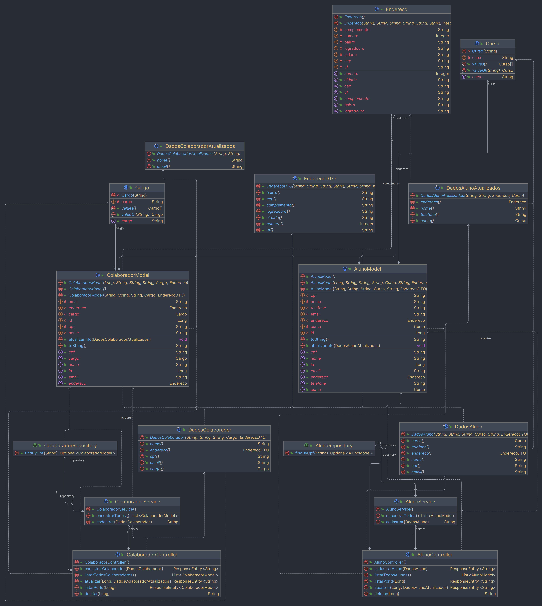

# 🏫 Vai Na Escola

Um sistema escolar com Spring Boot.

## 📚 Tabela de Conteúdos

- [🏦Vai Nu Bank](#-vai-nu-bank)
    - [📚 Tabela de Conteúdos](#-tabela-de-conteúdos)
    - [📋 Descrição](#-descrição)
        - [🚀 Funcionalidades](#-funcionalidades)
        - [📸 Prévia](#-prévia)
    - [⚙️ Construção](#️-construção)
        - [💻 Tecnologias](#-tecnologias)
        - [🛠️ Ferramentas](#️-ferramentas)
        - [📌 Versão](#-versão)
    - [✏️ Aprendizado](#️-aprendizado)
    - [✒️ Autores](#️-autores)
    - [🎁 Agradecimentos](#-agradecimentos)
    - [📨 Contato](#-contato)

## 📋 Descrição

Este é um projeto de uma API RESTful que simula um sistema de criação e controle de colaboradores e alunos de uma
ambiente acadêmico. O projeto foi desenvolvido com Spring Boot, MySQL e as requisições realizadas pelo Imsomnia.
Esse projeto foi lançado como o desafio final do módulo 02 do curso de back-end do "Vai na Web".
Sua principal proposta era colocar todos os conhecimentos aprendidos no módulo, desde o uso do paradigma de orientação
a objetos, até a criação de um banco de dados modelado com ajuda de diagramas UML e a manipulação de dados com o Spring
Boot, além de simulação de requisições pelo Insomnia.

### 🚀 Funcionalidades

As funcionalidades disponíveis para os usuários estão listadas abaixo:

- Cadastrar um novo colaborador
- Cadastrar um novo aluno
- Listar todos os colaboradores
- Listar todos os alunos
- Buscar um colaborador pelo ID
- Buscar um aluno pelo ID
- Atualizar um colaborador
- Atualizar um aluno
- Deletar um colaborador
- Deletar um aluno

### 📸 Prévia

  

## ⚙️ Construção

Resumo geral dos recursos utilizados na construção do projeto.

### 💻 Tecnologias

Tecnologias utilizadas na construção do projeto:

### 🛠️ Ferramentas

Ferramentas utilizadas na construção do projeto:

### 📌 Versão

Utilizei o Git para o controle de versão.

Versão atual: 1.0 (primeira versão)

## ✏️ Aprendizado

Ao fazer esse projeto, aprendi a:

- Criar um projeto Spring Boot
- Instalar dependências do Spring Boot
- Criar um banco de dados MySQL
- Criar entidades e repositórios
- Criar controladores
- Criar serviços
- Criar DTOs
- Criar um diagrama de classes
- Organizar o projeto em pacotes
- Utilizar o Insomnia para simular requisições

## ✒️ Autores

* **Milton Salgado Leandro** - *Todo o Projeto* - [GitHub](https://github.com/milton-salgado)

## 🎁 Agradecimentos

* Agradeço ao instrutor Samuel Silverio e ao facilitador João Pedro Belo pelo auxílio no meu processo de aprendizagem e
  apoio na construção do projeto.
* Agradeço também a você, visitante, por visualizar o meu projeto!

## 📨 Contato

